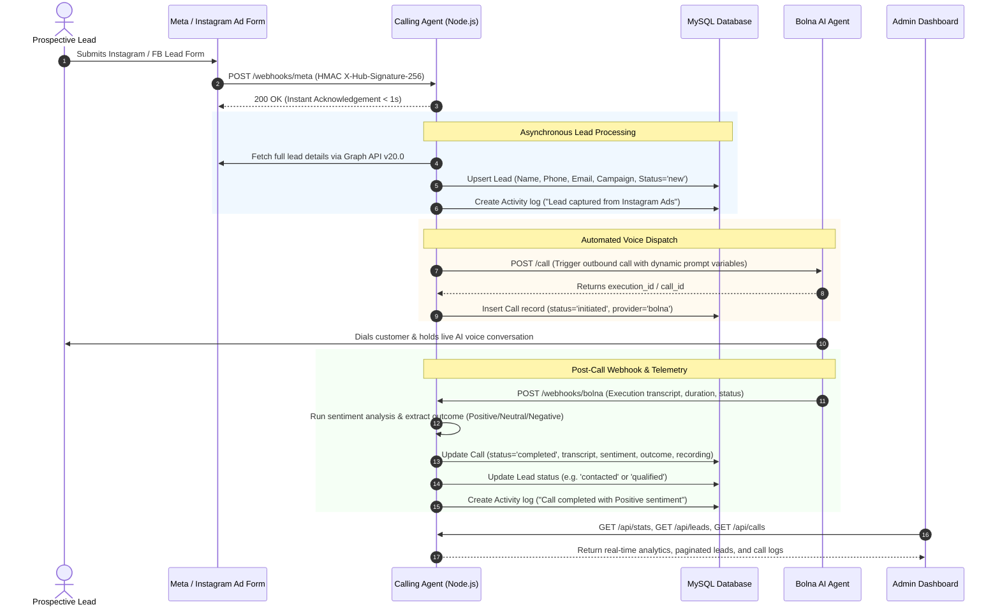

# Voice AI Calling Agent & CRM Orchestrator (Modular Monolith)

[](https://nodejs.org/)
[](#architecture-overview)
[](#voice-providers--integrations)
[](#database-schema)
[](LICENSE)

An enterprise-grade, production-ready backend that bridges **Meta / Instagram Lead Ads**, **AI Voice Agent (Bolna AI)**, and a **Persistent CRM Database (MySQL)**. It ingests leads in real-time, autonomously triggers conversational voice agents, extracts call transcripts, derives sentiments & outcomes, logs customer activity, and serves an interactive analytics dashboard.

---

## 📑 Table of Contents
1. [End-to-End System Flow](#-end-to-end-system-flow)
2. [Architecture Overview](#-architecture-overview)
3. [Core Modules](#-core-modules)
4. [Database Schema & Associations](#-database-schema--associations)
5. [Quick Start & Setup](#-quick-start--setup)
6. [Environment Variables](#-environment-variables)
7. [API Endpoints Reference](#-api-endpoints-reference)
8. [Voice Agent Configuration & Placeholders](#-voice-agent-configuration--placeholders)
9. [Testing & Verification](#-testing--verification)
10. [Security & Production Readiness](#-security--production-readiness)

---

## 🔄 End-to-End System Flow



---

## 🏛 Architecture Overview

This project is built following the **Modular Monolith ("Package by Feature" / Vertical Slice Architecture)** pattern. Rather than grouping all code horizontally by file type, each business domain is packaged as an independent, cohesive module with its own controller, service, routes, constants, and models.

```text
calling_agent/
├── package.json                 # Project manifest, dependencies, and npm scripts
├── server.js                    # Entry point wrapper
├── public/                      # Static assets for Admin Telemetry & CRM Dashboard
│   └── index.html               # Real-time SPA dashboard
├── scripts/                     # Automated testing and agent management CLI scripts
│   ├── testSentiment.js         # Unit tests for sentiment & transcript parsing
│   ├── testBackendCRUD.js       # Integration tests for MySQL models, CRUD, and pagination
│   ├── updateBolnaAgent.js      # CLI utility to sync prompt templates to Bolna API
│   └── verifyModules.js         # Architecture & module dependency integrity validator
└── src/
    ├── routes.js                # Aggregator for all module route definitions
    ├── server.js                # App bootstrapping, security middlewares & lifecycle
    │
    ├── core/                    # Shared Infrastructure Layer
    │   ├── config/              # Centralized environment & DB connection configs
    │   │   ├── database.config.js
    │   │   └── env.config.js
    │   ├── database/            # Sequelize database client & model associations
    │   │   ├── index.js         # Exports sequelize instance + all models
    │   │   └── models/          # System-level shared models (e.g. setting.model.js)
    │   ├── middlewares/         # Global HTTP middlewares
    │   │   ├── requestLogger.js # Winston HTTP request logger
    │   │   └── signatureMiddleware.js # Timing-safe HMAC-SHA256 signature validator
    │   └── utils/               # Shared utilities
    │       ├── errorHandler.js  # Global centralized error handler
    │       ├── formatResponse.js# Standardized JSON response envelope
    │       ├── logger.js        # Winston console and file logger
    │       ├── phoneUtils.js    # libphonenumber-js E.164 normalization
    │       └── sentimentUtils.js# Transcript parsing & rule-based sentiment extraction
    │
    └── modules/                 # Self-Contained Domain Modules
        ├── ai/                  # AI Scoring, cold emails & insight generation
        │   ├── ai.constants.js
        │   ├── ai.controller.js
        │   ├── ai.routes.js
        │   ├── ai.service.js
        │   └── index.js
        ├── bolna/               # Bolna AI voice provider integration
        │   ├── bolna.constants.js
        │   ├── bolna.controller.js
        │   ├── bolna.routes.js
        │   ├── bolna.service.js
        │   └── index.js
        ├── calls/               # Call history, simulation, and CDR logs
        │   ├── call.constants.js
        │   ├── call.controller.js
        │   ├── call.model.js
        │   ├── call.routes.js
        │   ├── call.service.js
        │   └── index.js
        ├── leads/               # CRM Lead management & timeline activities
        │   ├── activity.model.js
        │   ├── lead.constants.js
        │   ├── lead.controller.js
        │   ├── lead.model.js
        │   ├── lead.routes.js
        │   ├── lead.service.js
        │   └── index.js
        ├── meta/                # Meta Graph API v20.0 lead retrieval
        │   ├── meta.constants.js
        │   ├── meta.service.js
        │   └── index.js
        ├── stats/               # Real-time telemetry & aggregate analytics
        │   ├── stats.controller.js
        │   ├── stats.routes.js
        │   └── index.js
        └── webhooks/            # Inbound webhook receivers (Meta, Bolna)
            ├── webhook.constants.js
            ├── webhook.controller.js
            ├── webhook.routes.js
            └── index.js
```

---

## 📦 Core Modules

1. **`modules/webhooks`**: High-performance entry points for external notifications. Validates signatures, returns instant HTTP 200 responses to Meta, and dispatches background processing.
2. **`modules/meta`**: Communicates with Facebook/Instagram Graph API v20.0 to securely decrypt and extract form answers from Meta Lead Ads.
3. **`modules/bolna`**: Voice AI provider integration layer. Translates lead CRM data into dynamic prompt variables and triggers live phone calls.
4. **`modules/leads`**: Complete CRM domain containing Leads and Activity history, status transitions (`new` → `contacted` → `qualified` → `tour_booked` → `converted` / `lost`), and pagination.
5. **`modules/calls`**: Call Detail Records (CDR), duration tracking, recordings, transcripts, and sentiment tracking.
6. **`modules/ai`**: Google Gemini integration for automated lead quality scoring (1-100), AI cold email generation, and conversational insight extraction.
7. **`modules/stats`**: Real-time aggregation of conversion funnels, call completion rates, and provider health.

---

## 🗄 Database Schema & Associations

The system uses **Sequelize** with **MySQL**:

* **`Lead` (`leads`)**: Primary customer record (`id`, `name`, `phone`, `email`, `company`, `location`, `seats`, `budget`, `status`, `notes`, `source`, `sentiment`).
* **`Call` (`calls`)**: Individual call sessions (`call_id`, `lead_id`, `phone`, `provider`, `status`, `duration`, `recording_url`, `transcript`, `summary`, `sentiment`, `call_outcome`, `callback_time`).
* **`Activity` (`activities`)**: Audit trail and timeline entries (`id`, `lead_id`, `type`, `title`, `description`, `created_at`).
* **`Setting` (`settings`)**: System key-value configurations and active telephony provider flags.

### Model Associations
```text
Lead (1) ───< hasMany >─── (N) Call       (Cascade Delete)
Lead (1) ───< hasMany >─── (N) Activity   (Cascade Delete)
```

---

## 🚀 Quick Start & Setup

### 1. Prerequisites
* **Node.js**: v18.0.0 or higher
* **MySQL Server**: v8.0 or compatible instance running locally or via Docker

### 2. Installation
```bash
git clone <repository_url>
cd calling_agent
npm install
```

### 3. Database Setup
Create the MySQL database:
```sql
CREATE DATABASE IF NOT EXISTS calling_agent CHARACTER SET utf8mb4 COLLATE utf8mb4_unicode_ci;
```

### 4. Configuration
Create your `.env` file from the provided template:
```bash
cp .env.example .env
```
*(Fill in your MySQL credentials and voice provider API keys).*

### 5. Start the Server
* **Development (Hot-Reload via Nodemon)**:
  ```bash
  npm run dev
  ```
* **Production**:
  ```bash
  npm start
  ```

---

## ⚙️ Environment Variables

| Variable | Type | Default | Description |
| :--- | :--- | :--- | :--- |
| `PORT` | Number | `3000` | HTTP application port |
| `NODE_ENV` | String | `development` | Runtime mode (`development` / `production`) |
| `DB_HOST` | String | `localhost` | MySQL host address |
| `DB_PORT` | Number | `3306` | MySQL port |
| `DB_NAME` | String | `calling_agent`| MySQL database name |
| `DB_USER` | String | `root` | Database username |
| `DB_PASS` | String | `""` | Database password |
| `CALLING_PROVIDER` | String | `bolna` | Active telephony provider (`bolna`) |
| `BOLNA_API_KEY` | String | — | Bolna AI API Authorization Key |
| `BOLNA_AGENT_ID` | String | — | Bolna AI Agent UUID |
| `BOLNA_FROM_NUMBER` | String | — | Outbound caller ID (E.164 format) |
| `META_VERIFY_TOKEN` | String | — | Custom verification token for Meta webhook |
| `META_APP_SECRET` | String | — | Facebook App Secret for HMAC validation |
| `META_PAGE_ACCESS_TOKEN`| String | — | Meta Page Access Token with `leads_retrieval` |
| `GEMINI_API_KEY` | String | — | (Optional) Google Gemini API Key for AI features |

---

## 📡 API Endpoints Reference

### 1. Webhooks (`/webhooks`)
* `GET  /webhooks/meta` — Meta Webhook verification handshake (`hub.challenge`).
* `POST /webhooks/meta` — Ingests lead generation events with HMAC verification.
* `POST /webhooks/bolna` — Ingests Bolna post-call execution transcripts & statuses.

### 2. CRM Leads (`/api/leads`)
* `GET    /api/leads` — Paginated lead list with status & search filters (`?page=1&limit=20&status=new&search=john`).
* `POST   /api/leads` — Manually create a new CRM lead.
* `GET    /api/leads/:id` — Get full lead profile with associated call history & activities.
* `PATCH  /api/leads/:id` — Update lead attributes or pipeline stage.
* `DELETE /api/leads/:id` — Remove a lead and cascade delete linked records.
* `POST   /api/leads/:id/notes` — Append a timestamped note and create an Activity record.

### 3. Calls & Telephony (`/api/calls` & `/api/test-call`)
* `GET  /api/calls` — Paginated list of call detail records.
* `GET  /api/calls/:id` — Detailed call transcript, sentiment, and recording URL.
* `POST /api/test-call` — Dispatch an immediate outbound AI voice call to any phone number.
* `POST /api/simulate-call` — Test the post-call sentiment pipeline without dialing real phones.

### 4. Telemetry & Analytics (`/api/stats`)
* `GET /api/stats` — Real-time aggregate counters, sentiment breakdown, and provider status.
* `GET /health` — Kubernetes/Docker health probe.

### 5. AI Features (`/api/ai`)
* `POST /api/ai/score` — Compute automated qualification scores for leads.
* `POST /api/ai/email` — Generate personalized sales follow-up drafts.
* `POST /api/ai/insights` — Extract strategic objections and next-steps from call transcripts.

---

## 🎙 Voice Agent Configuration & Placeholders

When setting up your prompt on **Bolna AI**, you can inject live customer details automatically. The system replaces these variables dynamically before dialing:

| Variable | Description | Example Prompt Usage |
| :--- | :--- | :--- |
| `{name}` / `{lead_name}` | Customer's full name | `"Hi {name}, I'm calling from BizzHub."` |
| `{first_name}` | Extracted first name | `"Hello {first_name}, thanks for your interest!"` |
| `{company}` | Company name | `"Calling regarding your inquiry for {company}."` |
| `{location}` | Preferred office center | `"We have private cabins ready in {location}."` |
| `{seats}` | Inquired team size | `"I see you're looking for {seats} seats."` |
| `{lead_id}` | Unique CRM reference ID | `"Reference number {lead_id}."` |

---

## 🧪 Testing & Verification

The repository includes a comprehensive testing suite for both unit-level and end-to-end functionality:

```bash
# 1. Verify Modular Monolith structure and export resolutions
node scripts/verifyModules.js

# 2. Run the transcript extraction & sentiment analysis test suite
node scripts/testSentiment.js

# 3. Test MySQL database CRUD, pagination, and associations
node scripts/testBackendCRUD.js

# 4. Sync prompt configuration to Bolna AI
node scripts/updateBolnaAgent.js
```

---

## 🔒 Security & Production Readiness

* **Zero-Downtime Webhook Acknowledgment**: Responds to Meta within milliseconds, eliminating webhook delivery timeouts.
* **Cryptographic Signature Verification**: Validates Meta incoming requests with `X-Hub-Signature-256` using timing-safe comparisons (`crypto.timingSafeEqual`) to prevent timing attacks.
* **Defense-in-Depth Security Headers**: Hardened with **Helmet** (Content Security Policy, HSTS, XSS protection).
* **Sanitization**: Protects against HTTP Parameter Pollution (`hpp`) and Cross-Site Scripting (`xss-clean`).
* **Connection Resilience**: Database client includes exponential-backoff connection retries upon startup.
* **Graceful Shutdown**: Intercepts `SIGINT` and `SIGTERM` to safely drain active connections and close database pools before process termination.