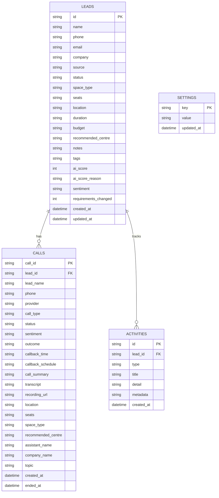

# BizzHub CRM — Database Schema & Architecture

## Overview
The BizzHub backend uses **Node 22 native SQLite (`node:sqlite`)** with Write-Ahead Logging (WAL) enabled. The database file is located at `data/bizzhub.db`.

---

## Entity Relationship Diagram (ERD)

---

## Tables Specification

### 1. `leads` Table
Stores contact information, space requirements, pipeline status, and AI scoring.

| Column | Type | Constraints | Description |
| :--- | :--- | :--- | :--- |
| `id` | `TEXT` | `PRIMARY KEY` | Unique ID (e.g. `lead_1788515020614_o1d0`). |
| `name` | `TEXT` | `NOT NULL` | Lead prospect full name. |
| `phone` | `TEXT` | `INDEXED` | Contact telephone number (e.g. `+91 9811223344`). |
| `email` | `TEXT` | | Prospect email address. |
| `company` | `TEXT` | | Company / business name. |
| `source` | `TEXT` | `DEFAULT 'website'` | Channel (`website`, `instagram`, `facebook`, `whatsapp`, `google_ads`, `call`, `manual`). |
| `status` | `TEXT` | `DEFAULT 'new'`, `INDEXED` | Pipeline stage (`new`, `contacted`, `qualified`, `tour_scheduled`, `converted`, `lost`). |
| `space_type` | `TEXT` | | Space requirement (`Managed Office`, `Dedicated Desk`, `Private Cabin`, `Virtual Office`). |
| `seats` | `TEXT` | | Requested seat count. |
| `location` | `TEXT` | | Target locality in Bangalore (e.g. `Koramangala`, `Whitefield`). |
| `duration` | `TEXT` | | Desired lease tenure. |
| `budget` | `TEXT` | | Monthly budget constraint. |
| `recommended_centre` | `TEXT` | | AI / Voice agent recommended facility. |
| `notes` | `TEXT` | | Freeform notes and comments. |
| `tags` | `TEXT` | `DEFAULT '[]'` | JSON array string of tags (e.g. `["enterprise", "urgent"]`). |
| `ai_score` | `INTEGER` | | AI intent score (1 to 10). |
| `ai_score_reason` | `TEXT` | | Short rationale for AI score. |
| `sentiment` | `TEXT` | | Latest call sentiment (`Positive`, `Neutral`, `Negative`). |
| `requirements_changed` | `INTEGER` | `DEFAULT 0` | Flag (0 or 1) indicating if requirements modified during call. |
| `created_at` | `TEXT` | `NOT NULL`, `INDEXED` | ISO 8601 creation timestamp. |
| `updated_at` | `TEXT` | `NOT NULL` | ISO 8601 last update timestamp. |

---

### 2. `calls` Table
Stores voice call sessions, recordings, outcomes, and agent metrics.

| Column | Type | Constraints | Description |
| :--- | :--- | :--- | :--- |
| `call_id` | `TEXT` | `PRIMARY KEY` | Unique execution / session identifier. |
| `lead_id` | `TEXT` | `INDEXED` | Foreign link to `leads.id` if matched. |
| `lead_name` | `TEXT` | | Prospect name at time of call. |
| `phone` | `TEXT` | `INDEXED` | Destination phone number. |
| `provider` | `TEXT` | `DEFAULT 'bolna'` | Voice telephony provider (`bolna`). |
| `call_type` | `TEXT` | `DEFAULT 'confirm_agent'` | Strategy (`confirm_agent`, `just_call`, `follow_up`, `schedule_callback`). |
| `status` | `TEXT` | `DEFAULT 'initiated'` | Execution status (`initiated`, `completed`, `failed`). |
| `sentiment` | `TEXT` | | Sentiment extracted from conversation. |
| `outcome` | `TEXT` | | Call resolution summary (e.g. `Site Visit Confirmed`, `Callback Requested`). |
| `callback_time` | `TEXT` | | Requested callback time (e.g. `4:30 PM`). |
| `callback_schedule` | `TEXT` | | Scheduled future ISO datetime. |
| `call_summary` | `TEXT` | | Condensed LLM summary of the conversation. |
| `transcript` | `TEXT` | | Full turn-by-turn dialogue transcript. |
| `recording_url` | `TEXT` | | Audio recording URL. |
| `location` | `TEXT` | | Location extracted or requested during call. |
| `original_location` | `TEXT` | | Baseline location prior to call. |
| `seats` | `TEXT` | | Seat count confirmed in call. |
| `original_seats` | `TEXT` | | Baseline seat count prior to call. |
| `space_type` | `TEXT` | | Workspace category. |
| `recommended_centre` | `TEXT` | | Specific centre suggested by agent. |
| `assistant_name` | `TEXT` | | AI agent persona name (e.g. `Sophia`). |
| `company_name` | `TEXT` | | Company name persona (e.g. `BizzHub`). |
| `topic` | `TEXT` | | Conversation topic context. |
| `source` | `TEXT` | | Initiation trigger source (`call`, `instagram_lead_ad`, etc.). |
| `created_at` | `TEXT` | `NOT NULL`, `INDEXED` | Initiation timestamp. |
| `ended_at` | `TEXT` | | Completion timestamp. |

---

### 3. `activities` Table
Logs discrete timeline events associated with leads.

| Column | Type | Constraints | Description |
| :--- | :--- | :--- | :--- |
| `id` | `TEXT` | `PRIMARY KEY` | Unique activity identifier (e.g. `act_1788515020641_ca6y`). |
| `lead_id` | `TEXT` | `NOT NULL`, `INDEXED` | Target lead identifier. |
| `type` | `TEXT` | `NOT NULL` | Activity type (`created`, `call`, `email`, `whatsapp`, `note`, `status_change`, `ai_score`). |
| `title` | `TEXT` | `NOT NULL` | Short title / headline for UI timeline. |
| `detail` | `TEXT` | | Detailed narrative or notes. |
| `metadata` | `TEXT` | | JSON string with structured parameters (e.g. `{ "oldStatus": "new", "newStatus": "contacted" }`). |
| `created_at` | `TEXT` | `NOT NULL`, `INDEXED` | Timestamp of event. |

---

### 4. `settings` Table
Key-value configuration store for CRM preferences and secrets.

| Column | Type | Constraints | Description |
| :--- | :--- | :--- | :--- |
| `key` | `TEXT` | `PRIMARY KEY` | Configuration key. |
| `value` | `TEXT` | | Configuration value or JSON string. |
| `updated_at` | `TEXT` | `NOT NULL` | Last modified timestamp. |
